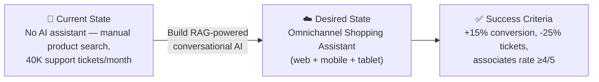

# 📋 Step 1: Requirements - moda-iberica-assistant


<details open>
<summary><strong>📑 Requirements Overview</strong></summary>

- [🎯 Project Overview](#-project-overview)
- [🚀 Functional Requirements](#-functional-requirements)
- [⚡ Non-Functional Requirements (NFRs)](#-non-functional-requirements-nfrs)
- [🔒 Compliance & Security Requirements](#-compliance--security-requirements)
- [💰 Budget](#-budget)
- [🔧 Operational Requirements](#-operational-requirements)
- [🌍 Regional Preferences](#-regional-preferences)
- [📊 Complexity Classification](#-complexity-classification)
- [📋 Summary for Architecture Assessment](#-summary-for-architecture-assessment)
- [References](#references)

</details>

> Generated by @requirements agent | 2026-05-28

| ⬅️ Previous | 📑 Index            | Next ➡️                                                        |
| ----------- | ------------------- | -------------------------------------------------------------- |
| —           | [README](README.md) | [02-architecture-assessment.md](02-architecture-assessment.md) |

## 🎯 Project Overview

| Field                   | Value                                                                                       |
| ----------------------- | ------------------------------------------------------------------------------------------- | --- | ------------------ | ----------------------------------------------------------------------------------------------------------------------------------------------------------------------------------------------------------------- |
| **Project Name**        | moda-iberica-assistant                                                                      |
| **Project Type**        | AI-Augmented Conversational Application (RAG)                                               |
| **Timeline**            | June 2026 → October 2026 (production before Black Friday peak)                              |
| **Primary Stakeholder** | Elena Vargas, Chief Digital Officer                                                         |
| **Business Context**    | Conversational AI shopping assistant for omnichannel fashion retail (web, mobile, in-store) |     | **Build Decision** | Custom build (Azure OpenAI + Foundry Agent Service) — Copilot Studio evaluated and ruled out due to multilingual RAG complexity, deep SAP/OMS integration needs, and brand-specific response control requirements |

### Business Context

| Field               | Value                                                                                                     |
| ------------------- | --------------------------------------------------------------------------------------------------------- |
| Industry / Vertical | Retail / E-Commerce (Fashion)                                                                             |
| Company Size        | Mid-Market (~€450M revenue, ~180 stores across Spain & Portugal)                                          |
| Current State       | Greenfield (new build — existing Azure tenant with dev subscriptions only, no CAF landing zone)           |
| Migration Source    | N/A (greenfield)                                                                                          |
| Business Drivers    | Online conversion uplift, call center deflection, store associate enablement, competitive differentiation |
| Success Criteria    | 15% online conversion lift, 25% ticket deflection (~10K fewer tickets/month), associate rating ≥4/5       |

### State Transition



### Phased Delivery Plan

| Phase              | Target        | Scope                                                    | Channels              | Languages  |
| ------------------ | ------------- | -------------------------------------------------------- | --------------------- | ---------- |
| Phase 1 (MVP)      | August 2026   | Product search + FAQ + stock check                       | Web only              | ES, PT     |
| Phase 2 (Full)     | October 2026  | All FRs, outfit recommendations, associate mode          | Web + Mobile + Tablet | ES, PT, CA |
| Phase 3 (Optimise) | December 2026 | Product description generation, advanced personalisation | All                   | All        |

> **Black Friday minimum scope**: Phase 2 complete — all customer-facing capabilities operational on web and mobile with store associate mode on tablets.

### Platform Prerequisites (In Scope)

| Prerequisite                                                             | Timeline           | Owner           |
| ------------------------------------------------------------------------ | ------------------ | --------------- |
| Provision production Azure subscription                                  | June 2026 (Week 1) | Platform team   |
| CAF-aligned landing zone (hub-spoke VNet, MG placement, Policy baseline) | June–July 2026     | Platform team   |
| Azure OpenAI quota request (GPT-5 or GPT-4o fallback)                    | June 2026 (Week 1) | Cloud architect |
| Entra ID B2C tenant provisioning                                         | July 2026          | Identity team   |

## 🚀 Functional Requirements

### Core Capabilities

| #   | Capability                      | Priority  | Acceptance Criteria                                                   |
| --- | ------------------------------- | --------- | --------------------------------------------------------------------- |
| 1   | Product search & discovery      | 🔴 Must   | Finds relevant products from 85K SKU catalog via natural language     |
| 2   | Outfit recommendations          | 🔴 Must   | Suggests complementary items based on style, season, and preferences  |
| 3   | Real-time store stock check     | 🔴 Must   | Returns current inventory at nearby stores within 3 seconds           |
| 4   | FAQ answering (returns, sizing) | 🔴 Must   | Deflects ≥25% of return/policy questions vs. current call center load |
| 5   | Order status lookup             | 🔴 Must   | Retrieves "where is my order" from Salesforce Service Cloud           |
| 6   | Current promotions awareness    | 🟡 Should | Surfaces relevant active campaigns from SharePoint                    |
| 7   | Store associate mode (tablet)   | 🔴 Must   | Same assistant with associate-specific context and elevated access    |
| 8   | Multilingual support (ES/CA/PT) | 🔴 Must   | Responds accurately in Spanish, Catalan, and Portuguese               |
| 9   | Product description generation  | 🟡 Should | Generates copy for new SKUs to relieve copywriter backlog             |
| 10  | Style guide awareness           | 🟡 Should | References 200-page merchandising style guide in recommendations      |

### User Types

| User Type       | Description                                         | Est. Count       | Access Level |
| --------------- | --------------------------------------------------- | ---------------- | ------------ |
| Online Customer | Web/mobile shoppers engaging with assistant         | 1,000–10,000/day | Consumer     |
| Store Associate | In-store staff using tablets to assist customers    | ~1,000           | Contributor  |
| Merchandising   | Team managing style guide and product descriptions  | ~20              | Contributor  |
| Admin / DevOps  | Platform team managing the assistant infrastructure | ~10              | Admin        |

### Integrations

| System                   | Direction | Protocol  | Auth Method         | SLA   |
| ------------------------ | --------- | --------- | ------------------- | ----- |
| SAP Commerce Cloud       | Inbound   | REST      | OAuth 2.0           | 99.9% |
| OMS (Inventory)          | Inbound   | REST      | API Key → Key Vault | 99.9% |
| Salesforce Service Cloud | Inbound   | REST      | OAuth 2.0           | 99.9% |
| SharePoint (Marketing)   | Inbound   | Graph API | Managed Identity    | 99.9% |
| Style Guide (PDF)        | Inbound   | Blob      | Managed Identity    | N/A   |

### Data Types

| Category               | Sensitivity | Est. Volume       | Retention | Residency |
| ---------------------- | ----------- | ----------------- | --------- | --------- |
| Customer PII           | 🔴 High     | ~2M profiles      | Per GDPR  | EU-only   |
| Order history          | 🟡 Medium   | ~10M orders/yr    | 3 years   | EU-only   |
| Product catalog (SKUs) | 🟢 Low      | 85K SKUs          | Current   | EU-only   |
| Inventory levels       | 🟢 Low      | Real-time/store   | 24h       | EU-only   |
| Conversation logs      | 🟡 Medium   | ~50K sessions/day | 90 days   | EU-only   |
| Marketing content      | 🟢 Low      | ~500 assets       | Current   | EU-only   |

### Architecture Pattern

| Field              | Value                                                                                                                                                                             |
| ------------------ | --------------------------------------------------------------------------------------------------------------------------------------------------------------------------------- |
| Workload Pattern   | AI-Augmented Application (RAG + Conversational)                                                                                                                                   |
| Recommended Option | Azure OpenAI + AI Search + Container Apps + Cosmos DB                                                                                                                             |
| Tier               | Balanced                                                                                                                                                                          |
| Justification      | RAG pattern for multi-source retrieval (catalog, policies, inventory); Container Apps for autoscale during peak; Cosmos DB for low-latency session state and conversation history |

## ⚡ Non-Functional Requirements (NFRs)

| WAF Pillar     | Metric             | Target                               | Current | Gap        |
| -------------- | ------------------ | ------------------------------------ | ------- | ---------- |
| 🔄 Reliability | SLA                | 99.9%                                | N/A     | Greenfield |
| 🔄 Reliability | RTO                | 4 hours                              | N/A     | Greenfield |
| 🔄 Reliability | RPO                | 1 hour                               | N/A     | Greenfield |
| ⚡ Performance | API Response (p95) | < 3,000 ms                           | N/A     | Greenfield |
| ⚡ Performance | Concurrent Users   | 2,000 (peak)                         | N/A     | Greenfield |
| ⚡ Performance | Token Throughput   | 10K–100K TPM (est. ~130K peak)       | N/A     | Greenfield |
| 🔒 Security    | Auth Method        | Entra ID B2C + Workforce             | —       | —          |
| 🔒 Security    | Encryption         | At-rest + In-transit (TLS 1.2+)      | —       | —          |
| 🔒 Security    | Data Residency     | EU-only; Azure OpenAI zero-data-retention (service-side); app-layer logs in Cosmos DB (90d) | — | — |
| 💰 Cost        | Monthly Budget     | €15,000–€30,000                      | —       | —          |
| 🔧 Operations  | Uptime Monitoring  | Yes                                  | —       | —          |

### Scalability

| Dimension        | Current (Pilot) | 6-Month Projection | 12-Month Projection |
| ---------------- | --------------- | ------------------ | ------------------- |
| Users            | 200–300 conc.   | 1,000 concurrent   | 2,000+ concurrent   |
| Data Volume      | 85K SKUs        | 85K SKUs           | 100K SKUs           |
| Transactions/day | ~10K sessions   | ~30K sessions      | ~50K sessions       |

## 🔒 Compliance & Security Requirements

### Regulatory Frameworks

<details>
<summary><strong>GDPR</strong> — Applicable ✅</summary>

| Requirement      | Applicability | Notes                                                               |
| ---------------- | ------------- | ------------------------------------------------------------------- |
| EU data subjects | Yes           | All customers in Spain/Portugal are EU data subjects                |
| Data residency   | Yes           | PII must remain in EU; swedencentral region enforced                |
| Right to erasure | Yes           | Must support GDPR Article 17 deletion requests on conversation logs |

</details>

<details>
<summary><strong>LOPDGDD (Spain)</strong> — Applicable ✅</summary>

| Requirement              | Applicability | Notes                                            |
| ------------------------ | ------------- | ------------------------------------------------ |
| Data protection officer  | Yes           | Required given scale of personal data processing |
| Consent management       | Yes           | Explicit consent for AI-assisted interactions    |
| Data breach notification | Yes           | 72-hour notification requirement to AEPD         |

</details>

<details>
<summary><strong>DORA</strong> — Applicable (readiness phase) ✅</summary>

| Requirement                 | Applicability | Notes                                       |
| --------------------------- | ------------- | ------------------------------------------- |
| ICT risk management         | Yes           | Operational resilience for digital services |
| Incident reporting          | Yes           | Major ICT incident reporting procedures     |
| Digital operational testing | Yes           | Resilience testing requirements             |

</details>

<details>
<summary><strong>EU AI Act</strong> — Applicable ✅</summary>

| Requirement              | Applicability | Notes                                                     |
| ------------------------ | ------------- | --------------------------------------------------------- |
| Risk classification      | Yes           | Customer-facing AI = limited risk (transparency required) |
| Transparency obligations | Yes           | Users must know they're interacting with AI               |
| Human oversight          | Yes           | Store associates provide human-in-the-loop for edge cases |
| Technical documentation  | Yes           | AI system documentation for accountability                |

</details>

<details>
<summary><strong>PCI-DSS</strong> — Not Applicable</summary>

| Requirement             | Applicability | Notes                                      |
| ----------------------- | ------------- | ------------------------------------------ |
| Cardholder data storage | No            | Assistant does not process payment data    |
| Network segmentation    | No            | No cardholder data environment             |
| Encryption requirements | No            | Covered by general TLS/encryption baseline |

</details>

### Data Residency

| Requirement              | Value                                             |
| ------------------------ | ------------------------------------------------- |
| Primary Region           | swedencentral                                     |
| Data Sovereignty         | EU-only (GDPR + LOPDGDD mandate)                  |
| Cross-region Replication | Architect to determine if 99.9% SLA requires active-passive DR to germanywestcentral |

### Authentication & Authorization

| Requirement       | Value                                                         |
| ----------------- | ------------------------------------------------------------- |
| Identity Provider | Entra ID B2C (customers) + Entra ID workforce (associates)    |
| MFA Requirement   | Conditional (required for associates, optional for customers) |
| RBAC Model        | Application-level (customer vs. associate vs. admin roles)    |

### Network Security

| Control                     | Required | Notes                                                     |
| --------------------------- | -------- | --------------------------------------------------------- |
| Private endpoints           | ✅       | All data services (Cosmos DB, AI Search, Storage, OpenAI) |
| VNet integration            | ✅       | Container Apps integrated into VNet                       |
| Public endpoints acceptable | ✅       | Front-end only (via APIM with WAF)                        |
| WAF required                | ✅       | APIM + potential Front Door for DDoS protection           |

### Recommended Security Controls

| Control               | Recommended | User Confirmed | Notes                                       |
| --------------------- | ----------- | -------------- | ------------------------------------------- |
| Managed Identity      | Yes         | Yes            | Prefer over keys for all Azure service auth |
| Private Endpoints     | Yes         | Yes            | For all data services and AI endpoints      |
| WAF                   | Yes         | No             | Recommended for public APIM endpoint        |
| Key Vault for Secrets | Yes         | Yes            | OMS API key, integration credentials        |
| Diagnostic Settings   | Yes         | Yes            | Full audit logging for compliance           |
| TLS 1.2 Minimum       | Yes         | Yes            | All service-to-service communication        |
| Encryption at Rest    | Yes         | Yes            | Platform-managed keys (CMK if required)     |
| Network Isolation     | Yes         | Yes            | VNet integration + Private Link             |

## 💰 Budget

> [!NOTE]
> The Azure Pricing MCP server generates detailed cost estimates during
> architecture assessment (Step 2). Provide an approximate budget here.

| Field              | Value                                                  |
| ------------------ | ------------------------------------------------------ |
| 💰 Monthly Budget  | €15,000–€30,000 (run costs)                            |
| 📅 Annual Budget   | €600,000 total (build + run, Year 1)                   |
| 🚦 Limit Type      | 🟡 Soft (board-approved, can negotiate)                |
| 📊 Cost Model Pref | Consumption (PAYG for AI, reserved for infra possible) |

### Cost Optimization Priorities

| Priority                         | Selected | Impact |
| -------------------------------- | -------- | ------ |
| Minimize compute costs           | ☐        | Medium |
| Prefer consumption-based pricing | ☑        | High   |
| Reserved instances acceptable    | ☑        | Medium |
| Spot instances for non-critical  | ☐        | Low    |

## 🔧 Operational Requirements

### Monitoring & Alerting

| Capability             | Required | Tool / Service       | Notes                                 |
| ---------------------- | -------- | -------------------- | ------------------------------------- |
| Application monitoring | ✅       | Application Insights | Conversation quality, latency, errors |
| Log aggregation        | ✅       | Log Analytics        | Centralized for compliance audit      |
| Alert notifications    | ✅       | Email + Teams        | DevOps team and CDO dashboard         |
| Custom dashboards      | ✅       | Azure Monitor        | Conversion metrics, deflection rate   |

### Support & Maintenance

| Requirement         | Value                                                          |
| ------------------- | -------------------------------------------------------------- |
| Support Hours       | Business hours (extended during peak: Black Friday, Christmas) |
| On-call Requirement | Yes (during peak retail periods)                               |
| Maintenance Windows | Tuesday 02:00–06:00 CET                                        |
| Change Management   | Team approval via Azure DevOps / GitHub PRs                    |

### Backup & Disaster Recovery

| Component          | Backup Frequency | Retention | Recovery Method |
| ------------------ | ---------------- | --------- | --------------- |
| Cosmos DB          | Continuous       | 30 days   | Point-in-time   |
| AI Search Index    | Daily            | 7 days    | Re-index        |
| Blob Storage (RAG) | Daily            | 30 days   | Geo-redundant   |
| Configuration      | Per deployment   | 90 days   | IaC redeploy    |

## 🌍 Regional Preferences

| Preference         | Value              | Justification                                         |
| ------------------ | ------------------ | ----------------------------------------------------- |
| Primary Region     | swedencentral      | EU GDPR-compliant, full Azure AI service availability |
| Failover Region    | germanywestcentral | EU paired alternative for DR                          |
| Availability Zones | Required           | 99.9% SLA with zone redundancy for all critical services |

## 📊 Complexity Classification

| Field      | Value                                                                                                                                                                 |
| ---------- | --------------------------------------------------------------------------------------------------------------------------------------------------------------------- |
| Complexity | `complex`                                                                                                                                                             |
| Criteria   | >8 resource types (11+), multi-env (Dev+Prod), 4 compliance frameworks, AI workload, 5 external integrations                                                          |
| Rationale  | RAG pipeline with multiple data sources, real-time inventory API, multilingual AI, strict EU data residency, DORA/EU AI Act compliance, peak scaling to 2K concurrent |

### AI Workload Requirements

| Field                  | Value                                                                                |
| ---------------------- | ------------------------------------------------------------------------------------ |
| AI Deployment Model    | Architect will recommend (PTU vs PAYG based on traffic)                              |
| Token Throughput (TPM) | 10K–100K TPM steady state; est. ~130K TPM peak (Black Friday 5x multiplier)          |
| RAG Data Sources       | Documents/PDFs, Databases/Structured Data, APIs (real-time)                          |
| Content Safety         | Strict content filtering (public-facing, brand protection)                           |
| Data Residency         | Azure OpenAI: zero-data-retention (service-side, no prompt logging). App-layer conversation logs captured in Cosmos DB before OpenAI call, 90-day retention, with GDPR Art. 17 erasure cascade |
| Languages              | Spanish, Catalan, Portuguese                                                         |
| Model Preference       | Primary: GPT-5 (quota request June 2026); Fallback: GPT-4o if unavailable/denied by July 2026 |
| Multitenancy           | false                                                                                |
| AI Services in Scope   | Azure OpenAI, Azure AI Search, Azure Content Safety, Microsoft Foundry Agent Service |

## 📋 Summary for Architecture Assessment

### Handoff Summary

| Aspect               | Key Points                                                                                          |
| -------------------- | --------------------------------------------------------------------------------------------------- |
| Critical Constraints | EU data residency (GDPR/LOPDGDD), zero-data-retention for Azure OpenAI, Oct 2026 deadline, no existing CAF landing zone |
| Key Decisions        | Bicep IaC, swedencentral region, Entra B2C + workforce auth, RAG pattern, custom build (not Copilot Studio), GPT-5 primary / GPT-4o fallback |
| Open Risks           | GPT-5 quota approval timeline, DORA applicability verification (retailer vs financial entity), Black Friday cost spike modelling |
| Recommended Pattern  | AI-Augmented Application (RAG + Conversational)                                                     |
| Budget Envelope      | €15,000–€30,000/month run; €600K total Y1                                                           |

### Requirements Completeness

| Section                  | Status | Notes                                 |
| ------------------------ | ------ | ------------------------------------- |
| Project Overview         | ✅     | Full business context captured        |
| Functional Requirements  | ✅     | 10 capabilities with priorities       |
| NFRs                     | ✅     | WAF pillars, scalability, AI-specific |
| Compliance & Security    | ✅     | 4 frameworks, full security controls  |
| Budget                   | ✅     | Monthly range + annual total          |
| Operational Requirements | ✅     | Monitoring, DR, support hours         |

---

### Additional Configuration

```yaml
iac_tool: Bicep
ai_workload: true
multitenancy: false
```

---

## References

> [!NOTE]
> 📚 The following Microsoft Learn resources provide additional guidance.

| Topic                      | Link                                                                                                |
| -------------------------- | --------------------------------------------------------------------------------------------------- |
| Well-Architected Framework | [Overview](https://learn.microsoft.com/azure/well-architected/)                                     |
| Azure Regions              | [Products by Region](https://azure.microsoft.com/explore/global-infrastructure/products-by-region/) |
| Compliance Offerings       | [Azure Compliance](https://learn.microsoft.com/azure/compliance/)                                   |
| Azure OpenAI               | [Documentation](https://learn.microsoft.com/azure/ai-services/openai/)                              |
| Azure AI Search            | [Documentation](https://learn.microsoft.com/azure/search/)                                          |
| EU AI Act                  | [Overview](https://learn.microsoft.com/azure/ai-services/responsible-use-of-ai-overview)            |

---

_Requirements captured using [plan-requirements.prompt.md](../../.github/prompts/plan-requirements.prompt.md) template_

---

<div align="center">

| ⬅️ — | 🏠 [Project Index](README.md) | ➡️ [02-architecture-assessment.md](02-architecture-assessment.md) |
| ---- | ----------------------------- | ----------------------------------------------------------------- |

</div>
