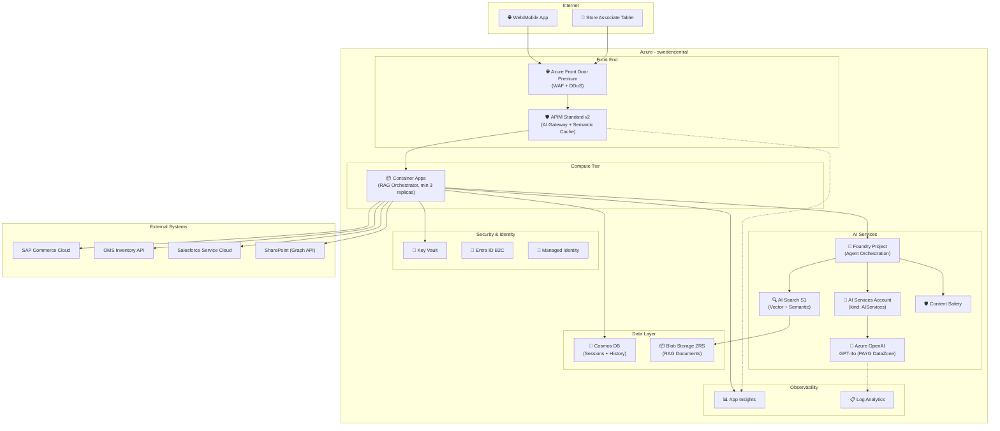
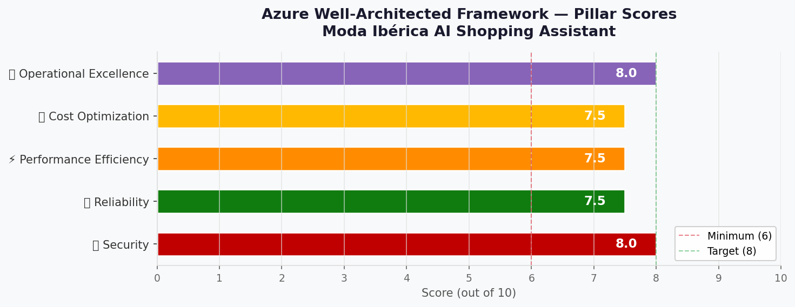

# 🏛️ Step 2: Architecture Assessment - moda-iberica-assistant

<strong>📑 Assessment Contents</strong>

- [✅ Requirements Validation](#-requirements-validation)
- [💎 Executive Summary](#-executive-summary)
- [🏛️ WAF Pillar Assessment](#-waf-pillar-assessment)
- [📦 Resource SKU Recommendations](#-resource-sku-recommendations)
- [🎯 Architecture Decision Summary](#-architecture-decision-summary)
- [🚀 Implementation Handoff](#-implementation-handoff)
- [🔒 Approval Gate](#-approval-gate)
- [References](#references)

> Generated by architect agent | 2026-06-01

| ⬅️ Previous                              | 📑 Index            | Next ➡️                                            |
| ---------------------------------------- | ------------------- | -------------------------------------------------- |
| [01-requirements.md](01-requirements.md) | [README](README.md) | [03-des-cost-estimate.md](03-des-cost-estimate.md) |

## ✅ Requirements Validation

| Requirement Area        | Status     | Validation Notes                                                                 |
| ----------------------- | ---------- | -------------------------------------------------------------------------------- |
| NFRs (SLA, RTO, RPO)    | ✅ Defined | 99.9% SLA, 4h RTO, 1h RPO (Cosmos/OpenAI); 24h RPO accepted for AI Search DR index |
| Compliance requirements | ✅ Defined | GDPR, LOPDGDD, EU AI Act — 3 frameworks with clear applicability (DORA removed: not applicable to fashion retail) |
| Budget (approximate)    | ✅ Defined | €15,000–€30,000/month; €600K Year 1 total                                        |
| Scale requirements      | ✅ Defined | 2K concurrent peak, 50K sessions/day at 12-month, 130K TPM peak                  |
| Security controls       | ✅ Defined | Private endpoints, Managed Identity, Entra B2C + workforce, TLS 1.2+             |
| Data residency          | ✅ Defined | EU-only (swedencentral), zero-data-retention for Azure OpenAI                    |

> [!NOTE]
> All requirement areas are fully defined. Proceeding to architecture assessment.

---

## 💎 Executive Summary

This assessment designs a **RAG-powered conversational AI shopping assistant** for Moda Ibérica, a mid-market fashion retailer (~180 stores, Spain & Portugal). The architecture leverages Azure OpenAI with retrieval-augmented generation across multiple data sources (85K SKU catalog, policies, real-time inventory) fronted by APIM as an AI Gateway for token governance, semantic caching, and model failover.

**Primary optimization**: Security (GDPR/EU compliance + data residency) balanced with Cost Optimization (PAYG model + semantic caching to manage unpredictable Year 1 token consumption).

**Key architecture decisions**:
- PAYG deployment for Azure OpenAI Year 1 (DataZoneStandard for EU data residency; re-evaluate PTU at 6 months)
- APIM Standard v2 as AI Gateway (semantic caching targets 25-30% cost reduction)
- Azure Front Door Premium with WAF for DDoS/bot protection at public ingress
- Hub-spoke network with private endpoints for all data services
- Zone-redundant deployment in swedencentral with active-passive DR to germanywestcentral
- Container Apps (Dedicated plan, min 3 replicas across 3 AZs) for predictable performance
- Mandatory PII redaction pipeline before Cosmos DB writes (GDPR data minimisation by design)
- Foundry Agent Service (AI Services `kind: AIServices` + Project) for agent orchestration

### Recommended Architecture

---

## 🏛️ WAF Pillar Assessment

### Overall Scores

| Pillar                    | Score | Confidence | Summary                                                           |
| ------------------------- | ----- | ---------- | ----------------------------------------------------------------- |
| 🔒 Security               | 8.0/10 | High       | Zero Trust with private endpoints, MI, Entra B2C, content safety, Front Door WAF |
| 🔄 Reliability            | 7.5/10 | Medium     | Zone-redundant primary (3 AZ), active-passive DR, 4h RTO achievable      |
| ⚡ Performance            | 7.5/10 | Medium     | Semantic caching + Redis hot cache + dedicated compute; AI latency managed |
| 💰 Cost Optimization      | 7.5/10 | Medium-High | Under budget with tiered model routing; Black Friday within ceiling |
| 🔧 Operational Excellence | 8.0/10 | Medium     | Full observability stack, IaC-first, automated runbooks via Logic Apps |

**Primary Pillar Optimized**: 🔒 Security (driven by 3 compliance frameworks + EU data residency)
**Trade-offs Accepted**: Performance ceiling from PAYG token limits vs. PTU predictability; higher per-token cost for flexibility; AI Search DR at 24h RPO (acceptable for fashion catalog data)

---

### 🔒 Security Assessment (8.0/10)

**Strengths:**

- Zero Trust network model: all data services behind private endpoints within VNet
- Azure Front Door Premium with WAF (OWASP 3.2 ruleset, bot manager) for DDoS protection at public ingress
- Managed Identity for all Azure service-to-service authentication (no keys in code)
- `disableLocalAuth: true` on AI Services and AI Search (key-based access explicitly disabled)
- Entra ID B2C for customer auth + Entra workforce for associates with MFA
- Azure AI Content Safety with prompt shields for prompt injection protection and brand-safe responses
- Key Vault for external integration credentials (OMS API key, OAuth secrets)
- TLS 1.2+ enforced on all service endpoints
- Zero-data-retention on Azure OpenAI (no Microsoft training on customer data)
- EU AI Act transparency: users informed they interact with AI
- **Mandatory PII redaction pipeline** (Azure AI Language PII detection) applied before every Cosmos DB write (GDPR Article 5(1)(c) data minimisation by design)
- Threat model references MITRE ATLAS + OWASP Generative AI Top 10 for public-facing inference endpoint

**Gaps:**

- ⚠️ Customer Managed Keys (CMK) not included — platform-managed encryption used (acceptable for initial deployment)
- ⚠️ Cosmos DB continuous backup retains deleted PII for 30 days — mitigated by reducing backup window to 7 days and disclosing SLA in privacy notice

**Recommendations:**

1. Implement Azure Policy at subscription level to enforce private endpoint requirements and deny public access
2. Configure Microsoft Defender for Cloud on the subscription for continuous security posture monitoring
3. Extend Log Analytics retention to 12 months (hot) for security/audit logs; conversation logs at 90 days (selective retention)
4. Commission EU AI Act formal risk classification before production launch (likely ‘limited risk’)

### 🔄 Reliability Assessment (7.5/10)

**Strengths:**

- Zone-redundant deployment: Container Apps with minimum 3 replicas across 3 AZs, Cosmos DB, AI Search
- Active-passive DR to germanywestcentral with 4h RTO
- RPO: 1h for Cosmos DB (continuous backup), 24h accepted for AI Search DR index (fashion catalog changes infrequently)
- Cosmos DB continuous backup with 7-day point-in-time restore (reduced from 30d for GDPR compliance)
- AI Search index re-indexable from source (Blob + API)
- APIM AI Gateway with model failover (GPT-4o primary → GPT-4o-mini degraded mode)
- Container Apps autoscale with min 3 replicas for instant readiness and true AZ redundancy

**Gaps:**

- ⚠️ Single-region AI Search (no native geo-replication — daily re-index for DR achieves 24h RPO, accepted as trade-off)
- ⚠️ Azure OpenAI regional dependency — if swedencentral has a model outage, failover latency increases
- ⚠️ AI Search full DR re-index time estimated at 1–2h (85K docs + embeddings); within 4h RTO but tight

**Recommendations:**

1. Pre-provision AI Search index in germanywestcentral (cold standby, refreshed daily — 24h RPO accepted)
2. Configure APIM circuit breaker with automatic failover to secondary OpenAI endpoint
3. Implement health probes at application level (not just infrastructure) for conversation quality monitoring
4. Pre-scale Container Apps replicas 48h before Black Friday (eliminate cold-start risk)

**External Integration Resilience** (5 dependencies: SAP, OMS, Salesforce, SharePoint, Style Guide):

| Integration  | Timeout | Retries | Circuit Breaker             | Degraded Response              |
| ------------ | ------- | ------- | --------------------------- | ------------------------------ |
| SAP Commerce | 2000ms  | 2 (200ms backoff) | Open after 5 failures/30s | Cached product data (1h stale) |
| OMS Inventory| 1500ms  | 2 (200ms backoff) | Open after 5 failures/30s | "Inventory check unavailable"  |
| Salesforce   | 3000ms  | 2 (500ms backoff) | Open after 3 failures/30s | Deferred to async queue        |
| SharePoint   | 2000ms  | 2 (200ms backoff) | Open after 5 failures/30s | Cached policy docs (24h stale) |
| Style Guide  | 1500ms  | 1                 | Open after 5 failures/60s | Generic styling guidance       |

Implement via resilience library (Polly/.NET or tenacity/Python). Bulkhead isolation prevents one integration’s failures from exhausting shared thread pool.

### ⚡ Performance Assessment (7.5/10)

**Strengths:**

- APIM semantic caching targets 25-30% reduction in OpenAI calls (sub-100ms for cached responses)
- **Azure Cache for Redis (C1 Standard)** for hot product recommendations and frequent outfit queries (<5ms reads)
- Dedicated Container Apps plan eliminates cold-start latency for peak traffic
- AI Search with semantic ranker for high-relevance results on first query
- Cosmos DB with zone-redundant, low-latency session storage (<10ms reads)
- Blob Storage with CDN potential for static product images (not in scope but extensible)

**Gaps:**

- ⚠️ GPT-4o full response time is 3–8s for complex RAG queries; TTFT (time-to-first-byte) achievable < 500ms with streaming
- ⚠️ Peak 130K TPM on PAYG may hit regional rate limits during Black Friday
- ⚠️ AI Search semantic ranker adds ~200ms per query on top of vector search

**Recommendations:**

1. Implement response streaming for OpenAI calls (TTFT < 500ms; full response 4–5s for complex queries)
2. **Clarify p95 SLA**: p95 TTFT < 500ms (streaming) is the target; full response p95 < 5s, p50 < 3s
3. Pre-compute popular product embeddings and cache frequent outfit recommendations in Cosmos DB
4. Request increased TPM quota for swedencentral (target 200K TPM) before October go-live
5. Monitor token concentration ratio: `peak_minute_tokens / avg_minute_tokens` — alert if > 5×

**Semantic Cache Correctness Strategy** (ARCH-015):

| Query Category | Cache Policy | TTL | Examples |
| -------------- | ------------ | --- | -------- |
| Static/slow-changing | Cache (semantic similarity) | 1–4 hours | Product descriptions, FAQ, brand info, style guide |
| Dynamic/real-time | Bypass cache (`cache-control: no-store`) | — | Inventory, pricing, order status, personalised data |

Implement at the APIM policy level with intent classification header. This prevents correctness violations
for real-time inventory queries (EU Directive 2019/770 on digital content).

**RPS Calculation**:
- 50K sessions/day × 4 API calls/session = 200K calls/day
- Average: 200K / (16h × 3600s) = ~3.5 RPS
- Peak (5× concentration): ~17.5 RPS
- Black Friday (3× day volume): ~52 RPS sustained

### 💰 Cost Assessment (7.5/10)

| Metric           | Value                                                       |
| ---------------- | ----------------------------------------------------------- |
| Monthly Estimate | ~$13,500/month (steady state, with tiered routing savings)  |
| Annual Estimate  | ~$172,000/year (weighted: 2mo ramp + 9mo steady + 1mo peak)  |
| Budget Status    | ✅ Well under budget (€15K–€30K ≈ $16,300–$32,600 at €1=$1.09) |
| Confidence       | Medium-High (MCP-verified pricing, 2026-06-03)               |

> 📎 Full cost breakdown: [03-des-cost-estimate.md](03-des-cost-estimate.md)

**Cost Optimization Applied:**

- PAYG for Azure OpenAI Year 1 (no PTU commitment until usage patterns stabilize)
- **Tiered model routing**: 25% of queries (FAQ, basic product info) → GPT-4o-mini; saves ~$2,400/month
- APIM semantic caching projected to save 25-30% on token costs (~$2,600–$3,150/month at steady state)
- Container Apps Dedicated plan (vs. AKS) reduces operational overhead and right-sizes for workload
- AI Search S1 (vs. S2) sufficient for 85K document corpus with 3 replicas for HA
- Reserved Instances evaluation at 6-month mark for Cosmos DB and Container Apps

**Cost Risks:**

- ⚠️ Black Friday month (November) projected at $29,500–$33,000 (within or near €30K ceiling with tiered routing)
- ⚠️ Token cost is 59% of total — reduced by tiered routing but still sensitive to cache miss rate
- ⚠️ Semantic ranker at $1/1K queries: ~$1,080/month at steady state (re-derived consistently from session assumptions)
- 🛡️ **Mitigation**: APIM session-level token cap to bound maximum monthly spend; tiered routing reduces peak AI cost by ~24%
- 💰 **Savings opportunities** (not yet quantified): Cosmos DB reserved capacity, Log Analytics commitment tier, Container Apps right-sizing at 6-month review

### 🔧 Operational Excellence Assessment (8.0/10)

**Strengths:**

- Infrastructure as Code (Bicep) for repeatable deployments across environments
- Full observability: Application Insights + Log Analytics + Azure Monitor dashboards
- APIM built-in analytics for token usage, latency percentiles, and error rates
- Cosmos DB continuous backup with automated point-in-time restore
- GitHub PRs for change management with approval workflows
- **Automated runbooks via Logic Apps**: model failover, cache invalidation, index rebuild, scaling events
- Azure Monitor action groups with automated Teams notifications for P1 incidents

**Gaps:**

- ⚠️ No chaos engineering or resilience testing planned before go-live
- ⚠️ AI model quality monitoring (hallucination detection, response accuracy) requires custom implementation

**Recommendations:**

1. Implement Azure Monitor action groups with automated Teams notifications for P1 incidents
2. Create a RAG quality evaluation pipeline (weekly batch evaluation of response accuracy vs. ground truth)
3. Define operational runbooks for: model failover, cache invalidation, index rebuild, scaling events
4. Schedule pre-Black-Friday load testing (October) with realistic conversation patterns

---

## 📦 Resource SKU Recommendations

| Service                 | Recommended SKU                  | Configuration                          | Monthly Est. | Justification                                           |
| ----------------------- | -------------------------------- | -------------------------------------- | ------------ | ------------------------------------------------------- |
| Azure OpenAI            | GPT-4o + GPT-4o-mini (Tiered, PAYG DataZone) | ~67K TPM avg, 130K peak; 75% complex→GPT-4o, 25% simple→mini | $7,950 | Tiered routing: complex RAG → GPT-4o ($0.00275/$0.011); FAQ/simple → mini ($0.000165/$0.00066); after 25% cache |
| Azure AI Search         | Standard S1                      | 1 unit, 3 replicas, semantic ranker   | $1,816       | S1 infra: $0.336/hr × 730 × 3 = $736; ranker: 1.08M/1K × $1.00 = $1,080 |
| APIM                    | Standard v2                      | 1 unit, semantic caching enabled      | $913         | $1.25/hr × 730; AI Gateway, token governance, model failover |
| Container Apps          | Dedicated (workload profile)     | 3 nodes × 2 vCPU / 4 GiB (min 3 for AZ) | $367         | vCPU: $0.057/hr × 6 × 730 + Mem: $0.005/hr × 12 × 730 + Mgmt: $73 |
| Cosmos DB               | NoSQL, Autoscale                 | 4000 RU/s max, zone-redundant, single-write-region, geo-redundant backup | $234 | $0.008/hr per 100 RU/s × 40 × 730; active-passive DR with manual failover |
| Key Vault               | Standard                         | ~10K operations/month                 | $1           | $0.03/10K operations                                    |
| Log Analytics           | Per-GB (Pay-As-You-Go)           | ~100 GB/month; 12-month security/audit, 90-day conversation | $335 | $3.35/GB × 100; includes archive tier for 12-month audit |
| Application Insights    | Workspace-based                  | ~50 GB/month telemetry                | $200         | $4.00/GB × 50; APM telemetry, distributed tracing       |
| Storage Account         | Standard ZRS, Hot tier           | ~200 GB (RAG documents + style guide) | $50          | Zone-redundant, EU residency, private endpoint          |
| Entra ID B2C            | P1 (Premium)                     | ~100K MAU projected                   | $150         | MAU-based pricing with conditional access               |
| Azure Content Safety    | Standard                         | ~1M text analyses/month + prompt shields | $75       | Per-request pricing for text moderation + output monitoring |
| Azure Front Door        | Premium                          | WAF policy (OWASP 3.2), bot manager   | $335         | Requests + data transfer + WAF policy; DDoS protection  |
| Microsoft Defender      | Enhanced (selective)             | Containers + Key Vault + Cosmos DB    | $495         | Defender for Containers ~$380 + KV ~$100 + Cosmos $5 + Storage $10 |
| Azure Budget            | —                                | €14K monthly + €27K peak (November)     | $0           | Cost governance with 80%/100%/120% alerts              |
| VNet + Private Endpoints| Standard                         | 1 VNet, 9 private endpoints, NSGs    | $125         | PE hourly + network overhead                            |
| Azure Monitor           | Platform diagnostics             | Diagnostic settings + 5 alert rules  | $51          | Metrics + alerts + action groups                        |
| Azure Cache for Redis   | Standard C1                      | 1 GB, hot product recs + outfit cache | $300         | <5ms reads for frequently requested recommendations     |
| Logic Apps (Runbooks)   | Consumption                      | ~5 automated runbooks, ~500 runs/month | $100        | Model failover, cache invalidation, index rebuild, scaling |
| **Total (Steady State)**|                                  |                                        | **$13,499**  | *Pricing source: Azure Pricing MCP (2026-06-03); tiered routing saves ~$2,400/month* |

<strong>Azure OpenAI</strong> — Deployment Model Comparison

| Model       | Throughput  | Price/1K Input | Price/1K Output | Monthly (67K TPM avg) | Fits?  |
| ----------- | ----------- | -------------- | --------------- | --------------------- | ------ |
| GPT-4o PAYG (DataZone) | On-demand   | $0.00275       | $0.011          | ~$10,395 (after 25% cache) | ✅     |
| GPT-4o PTU  | 1 PTU = 6 RPM | ~$2/hr/PTU   | Included        | ~$14,400 (10 PTU)     | ⚠️ Over-provisioned Y1 |
| GPT-4o-mini | On-demand   | $0.000165      | $0.00066        | ~$630                 | ⚠️ Lower quality for complex RAG |

**Selected**: GPT-4o PAYG DataZoneStandard — EU data residency guaranteed (GDPR Art.44); usage patterns unstable in Year 1; PTU evaluation at 6-month mark when monthly token consumption is predictable. Semantic caching via APIM reduces effective cost by 25-30%. `GlobalStandard` rejected: no EU data residency guarantee.

<strong>Azure AI Search</strong> — Tier Comparison

| Tier    | Storage | Partitions | Replicas | Price/hr  | Monthly    | Fits?  |
| ------- | ------- | ---------- | -------- | --------- | ---------- | ------ |
| Basic   | 2 GB    | 1          | 3        | ~$0.10    | ~$73       | ❌ Too small for 85K docs with vectors |
| S1      | 25 GB   | 12 max     | 12 max   | $0.336    | ~$245/unit | ✅ 3 replicas for 99.9% SLA |
| S2      | 100 GB  | 12 max     | 12 max   | $1.344    | ~$981/unit | ⚠️ Over-provisioned for 85K docs |

**Selected**: S1 with 3 replicas ($735 base + $1,080 semantic ranker) — provides 99.9% SLA with zone redundancy. 25 GB per partition sufficient for 85K product documents with vector embeddings (~5 GB estimated). Semantic ranker cost derived from: 4 queries/session × 30% ranker usage × 30K sessions/day × 30 days = 1.08M ranker queries/month.

<strong>APIM</strong> — Tier Comparison

| Tier          | Features                                     | Price/hr | Monthly | Fits?  |
| ------------- | -------------------------------------------- | -------- | ------- | ------ |
| Developer     | No SLA, single instance                      | $0.066   | $48     | ❌ No production SLA |
| Standard      | 99.95% SLA, no AI gateway features           | $0.941   | $687    | ⚠️ Missing semantic caching |
| Standard v2   | 99.95% SLA, AI gateway, semantic caching     | $1.250   | $912    | ✅     |
| Premium       | Multi-region, VNet injection                 | $3.829   | $2,795  | ⚠️ Over-provisioned |

**Selected**: Standard v2 — AI Gateway features (semantic caching, token rate limiting, model load balancing) justify the premium over Standard. Critical for cost optimization strategy.

---

## 🎯 Architecture Decision Summary

| Decision                        | Choice                               | Rationale                                                              |
| ------------------------------- | ------------------------------------ | ---------------------------------------------------------------------- |
| AI Deployment Model             | PAYG DataZoneStandard (Year 1)       | EU data residency guarantee; 10K-100K TPM range too wide for PTU; re-evaluate at 6mo |
| AI Gateway                      | APIM Standard v2                     | Semantic caching (25-30% savings), token governance, model failover    |
| Public Ingress Protection       | Azure Front Door Premium + WAF       | DDoS protection, OWASP 3.2 ruleset, bot manager, geo-filtering        |
| Compute Platform                | Container Apps (Dedicated, min 3)    | 3 replicas across 3 AZs for true zone redundancy; no K8s overhead     |
| Network Topology                | Hub-spoke with Private Endpoints     | Zero Trust; all data services isolated; Front Door → APIM as ingress   |
| Data Residency Strategy         | swedencentral + germanywestcentral DR | EU-only; satisfies GDPR, LOPDGDD; avoids cross-region data transfer   |
| Session Store                   | Cosmos DB NoSQL                      | Sub-10ms reads, single-write-region, geo-redundant backup, 7-day continuous backup |
| Search Strategy                 | AI Search S1 + Semantic Ranker       | Vector + keyword hybrid; semantic ranker for relevance in 3 languages  |
| Identity                        | Entra B2C (customers) + Workforce    | Separation of customer and employee identity planes                    |
| Observability                   | App Insights + Log Analytics         | End-to-end tracing, compliance audit trail (12-month retention for audit logs) |
| Content Safety                  | Azure AI Content Safety + Prompt Shields | Mandatory for public-facing AI; EU AI Act transparency compliance  |
| PII Data Protection             | Mandatory pre-storage redaction      | Azure AI Language PII detection before Cosmos DB write (GDPR Art. 5(1)(c) by design) |
| AI Model Routing                | Tiered (GPT-4o + GPT-4o-mini)        | 25% simple queries to mini saves ~$2,400/month; quality acceptable for FAQ/basic info |
| Hot Query Cache                 | Azure Cache for Redis C1             | Sub-5ms for popular product recommendations; reduces AI Search + OpenAI load |
| Incident Automation             | Logic Apps (5 automated runbooks)    | Model failover, cache invalidation, index rebuild, scaling, alert triage |
| DR Strategy                     | Active-Passive                       | 4h RTO; AI Search RPO accepted at 24h (catalog data changes infrequently) |
| Agent Orchestration             | Foundry Agent Service (standard setup) | AI Services account (`kind: AIServices`) + Foundry Project; customer-owned storage |
| Compliance Frameworks           | GDPR, LOPDGDD, EU AI Act             | DORA removed (not applicable to fashion retail)                        |

### Top Architecture Risks

| Risk                                  | WAF Pillar | Likelihood | Impact   | Mitigation                                           |
| ------------------------------------- | ---------- | ---------- | -------- | ---------------------------------------------------- |
| Black Friday token cost > €30K ceiling | 💰         | � Med    | 🟡 Med  | Tiered model routing reduces peak AI cost by ~24%; within or near ceiling |
| MVP timeline feasibility (8 weeks, 4 blockers) | 🔧 | 🔴 High | 🔴 High | Parallelize: B2C + landing zone Week 1; submit quota request immediately |
| GPT-5 quota denied (fallback to 4o)   | ⚡         | 🟡 Med    | 🟡 Med   | Architecture designed for GPT-4o; GPT-5 is stretch goal |
| AI Search DR re-index latency (1–2h)  | 🔄         | 🟢 Low    | 🔴 High  | Pre-provision cold standby; estimate: 85K docs at 2K embeddings/min = ~43min |
| PAYG rate limiting during peak        | ⚡         | 🟡 Med    | 🟡 Med   | Request quota increase to 200K TPM; implement queue  |
| Multilingual RAG quality degradation  | ⚡         | 🟡 Med    | 🟡 Med   | Language-specific prompt engineering + eval pipeline  |
| External integration cascading failure| 🔄         | 🟡 Med    | 🔴 High  | Circuit breakers + bulkhead isolation per integration |

---

## 🚀 Implementation Handoff

### Ready for iac-planner

The architecture is approved for implementation with the following key parameters:

| Parameter      | Value                                                    |
| -------------- | -------------------------------------------------------- |
| Region         | swedencentral (DR: germanywestcentral)                   |
| Environments   | dev, prod (min-viable; staging optional for Phase 3)     |
| Budget         | €15K–€30K/month (estimated: ~$13,500 ≈ €12,385 steady)  |
| Resource Count | 23 primary resources + networking components             |
| IaC Tool       | Bicep                                                    |
| Timeline       | June–October 2026 (MVP August, Full October)             |

### Resources to Provision

| #   | Resource                      | SKU                           | Key Config                                         |
| --- | ----------------------------- | ----------------------------- | -------------------------------------------------- |
| 1   | Resource Group                | —                             | `rg-moda-iberica-assistant-prod`                   |
| 2   | Virtual Network               | Standard                      | Hub-spoke, 10.0.0.0/16, 4 subnets                 |
| 3   | Azure Front Door              | Premium                       | WAF policy (OWASP 3.2), bot manager, DDoS          |
| 4   | Azure AI Services Account     | S0 (`kind: AIServices`)       | GPT-4o DataZoneStandard deployment, private endpoint, `disableLocalAuth: true` |
| 5   | Foundry Project               | Standard                      | Linked to AI Services account, standard agent setup, customer-owned storage |
| 6   | Azure AI Search               | Standard S1                   | 3 replicas, semantic ranker, private endpoint, `disableLocalAuth: true` |
| 7   | APIM                          | Standard v2                   | AI Gateway policies, semantic cache (with intent-based bypass for real-time queries) |
| 8   | Container Apps Environment    | Dedicated workload profile    | 3 nodes (min), VNet integrated, 3 AZ spread        |
| 9   | Container App (Orchestrator)  | 2 vCPU / 4 GiB               | Autoscale 3–10 replicas                            |
| 10  | Container App (PII Redaction) | 1 vCPU / 2 GiB               | Sidecar: Azure AI Language PII detection before Cosmos writes |
| 11  | Cosmos DB Account             | NoSQL, Autoscale              | Zone-redundant, 4000 RU/s max, single-write-region, geo-redundant backup, 7-day continuous backup |
| 12  | Key Vault                     | Standard                      | RBAC access, private endpoint                      |
| 13  | Storage Account               | Standard ZRS                  | Hot tier, private endpoint, no public blob access  |
| 14  | Log Analytics Workspace       | Per-GB                        | 12-month retention (audit/security logs); 90-day for conversation logs |
| 15  | Application Insights          | Workspace-based               | Connected to Log Analytics                         |
| 16  | Azure Content Safety          | S0                            | Prompt shields enabled, private endpoint           |
| 17  | Entra ID B2C                  | P1                            | Custom policies for ES/PT/CA locales               |
| 18  | Azure Budget                  | —                             | €14K monthly; alerts at 80%/100%/120%; peak budget €27K (November) |
| 19  | Microsoft Defender for Cloud  | Enhanced                      | Containers + Key Vault + Cosmos DB plans           |
| 20  | Private Endpoints (×9)        | —                             | AI Services, AI Search, Cosmos, KV, Storage, APIM, Content Safety, Foundry, Front Door origin |
| 21  | NSGs (×4)                     | Standard                      | Per-subnet, deny-all-inbound default               |
| 22  | Azure Cache for Redis         | Standard C1 (1 GB)            | Hot product recommendations, outfit cache, VNet integrated |
| 23  | Logic Apps (Runbooks)         | Consumption                   | Model failover, cache invalidation, index rebuild, scaling, alert triage |

### Security Requirements for Implementation

| Requirement              | Implementation                                                         |
| ------------------------ | ---------------------------------------------------------------------- |
| Private Endpoints        | Deploy PE for all data services; deny public network access            |
| Managed Identity         | System-assigned MI on Container App; RBAC roles for each target service |
| Disable Local Auth       | `disableLocalAuth: true` on AI Services + AI Search (no API keys)      |
| TLS 1.2 Minimum          | Set `minTlsVersion: 'TLS1_2'` on all applicable resources             |
| No Public Blob Access    | `allowBlobPublicAccess: false` + `allowSharedKeyAccess: false`         |
| Key Vault References     | Store OMS API key + OAuth client secrets; access via MI                |
| Content Safety + Shields | Pre-filter all user inputs; prompt shields + category filters enabled  |
| PII Redaction (MANDATORY)| Azure AI Language PII detection applied before every Cosmos DB write   |
| Diagnostic Settings      | Enable on all resources → Log Analytics (12-month audit; 90-day conversation) |
| GDPR Right to Erasure    | Cosmos DB TTL + cascade delete; 7-day backup window; disclose SLA in privacy notice |
| Front Door WAF           | OWASP 3.2 ruleset, bot manager, rate limiting at edge                  |
| Threat Model             | Document MITRE ATLAS + OWASP GenAI Top 10 attack vectors              |

### Monitoring Requirements for Implementation

| Requirement                | Implementation                                                     |
| -------------------------- | ------------------------------------------------------------------ |
| Application Monitoring     | App Insights SDK in Container App; custom metrics for RAG quality  |
| Token Usage Tracking       | APIM policy logs token consumption per request; monthly dashboards |
| Alert on SLA Breach        | Azure Monitor alert: TTFT p95 > 500ms → Teams notification         |
| Cost Alerts                | Budget alerts at 80% (€11.2K), 100% (€14K), 120% (€16.8K) + peak budget €27K |
| AI Quality Metrics         | Custom telemetry: groundedness score, relevance score, user rating |
| Compliance Audit Trail     | All admin operations logged to Log Analytics (immutable, 12 months)|
| Integration Health         | Circuit breaker state dashboard; per-integration success/failure rate |
| Model Drift Monitoring     | Weekly batch evaluation pipeline; alert if accuracy < baseline     |

---

## 🔒 Approval Gate

> [!IMPORTANT]
> **🏗️ Architecture Assessment Complete** (Revised post-challenger review)
>
> | Pillar      | Score   |
> | ----------- | ------- |
> | Security    | 8.0/10  |
> | Reliability | 7.5/10  |
> | Performance | 7.5/10  |
> | Cost        | 7.5/10  |
> | Operations  | 8.0/10  |
>
> **Estimated Monthly Cost**: ~$13,500 / ~€12,385 (steady state, under budget)
>
> **Peak Month (November)**: ~$29,500–$33,000 / ~€27,064–€30,275 (within or near €30K ceiling with tiered routing)
>
> **Annual Estimate**: ~$172,000 / ~€157,798 (weighted: 2mo ramp + 9mo steady + 1mo peak)
>
> **Confidence Level**: Medium-High (Azure Pricing MCP verified 2026-06-03)
>
> **Key revisions from challenger review**: Foundry Agent Service added to provisioning; Cosmos DB fixed to single-write-region; AI Search RPO accepted at 24h; PII redaction promoted to mandatory; Front Door + WAF added; DORA removed; min 3 Container App replicas for AZ redundancy
>
> **Cost optimizations applied**: Tiered model routing (GPT-4o-mini for 25% simple queries, saves ~$2,400/month); Redis hot cache reduces redundant AI calls; Logic Apps automated runbooks reduce manual ops overhead
>
> **Pricing data source**: Azure Retail Prices API via Azure Pricing MCP (queried 2026-06-03, swedencentral)
>
> - [ ] **Approved** — proceed to iac-planner
> - Approver: ___
> - Date: ___
>
> Reply **"approve"** to proceed to iac-planner, or provide feedback for revisions.

---

## References

> [!NOTE]
> 📚 The following Microsoft Learn resources informed this assessment.

| Topic                              | Link                                                                                             |
| ---------------------------------- | ------------------------------------------------------------------------------------------------ |
| Well-Architected Framework         | [Overview](https://learn.microsoft.com/azure/well-architected/)                                  |
| RAG on Azure                       | [Architecture](https://learn.microsoft.com/azure/architecture/ai-ml/architecture/rag-solution-design) |
| Azure OpenAI PAYG                  | [Pricing](https://learn.microsoft.com/azure/ai-services/openai/concepts/provisioned-throughput)  |
| AI Search Service Tiers            | [Tiers](https://learn.microsoft.com/azure/search/search-sku-tier)                                |
| APIM as AI Gateway                 | [Overview](https://learn.microsoft.com/azure/api-management/ai-gateway-overview)                 |
| Container Apps Dedicated Plan      | [Plans](https://learn.microsoft.com/azure/container-apps/plans)                                  |
| Cosmos DB Autoscale                | [Throughput](https://learn.microsoft.com/azure/cosmos-db/provision-throughput-autoscale)          |
| Azure Private Link                 | [Overview](https://learn.microsoft.com/azure/private-link/private-link-overview)                 |
| EU AI Act Compliance               | [Guidance](https://learn.microsoft.com/azure/ai-services/responsible-use-of-ai-overview)         |
| Azure Retail Prices API            | [API Reference](https://learn.microsoft.com/rest/api/cost-management/retail-prices/azure-retail-prices) |

---

_Assessment performed using Azure Well-Architected Framework. Pricing data from Azure Retail Prices API via Azure Pricing MCP (2026-06-03). All costs in USD; EUR conversion at €1 = $1.09._

---

| ⬅️ [01-requirements.md](01-requirements.md) | 🏠 [Project Index](README.md) | ➡️ [03-des-cost-estimate.md](03-des-cost-estimate.md) |
| -------------------------------------------- | ----------------------------- | ------------------------------------------------------ |

