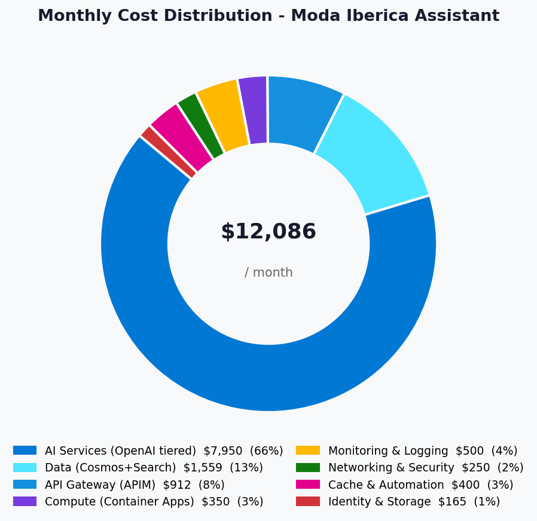
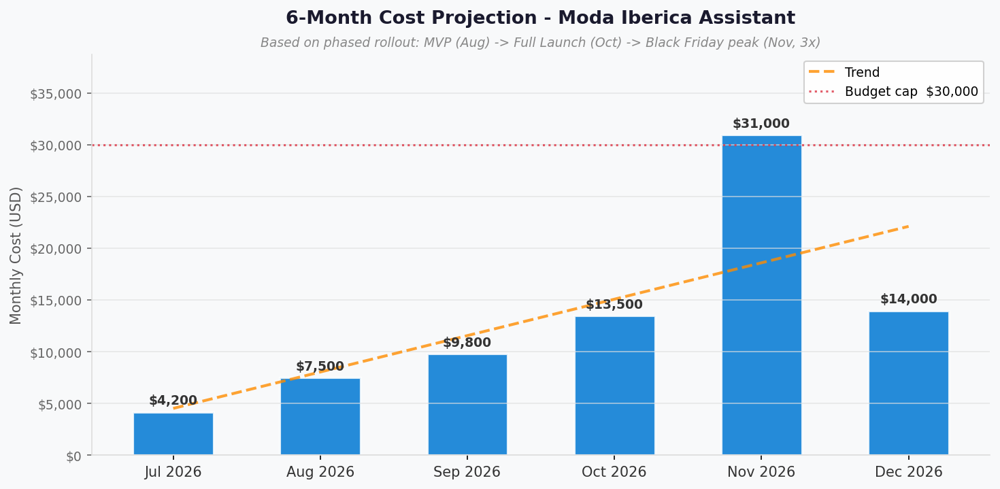

# 💰 Azure Cost Estimate: moda-iberica-assistant


<details open>
<summary><strong>📑 Cost Estimate Contents</strong></summary>

- [💵 Cost At-a-Glance](#-cost-at-a-glance)
- [✅ Decision Summary](#-decision-summary)
- [🔁 Requirements → Cost Mapping](#-requirements--cost-mapping)
- [📊 Top 5 Cost Drivers](#-top-5-cost-drivers)
- [🏛️ Architecture Overview](#-architecture-overview)
- [🧾 What We Are Not Paying For (Yet)](#-what-we-are-not-paying-for-yet)
- [⚠️ Cost Risk Indicators](#-cost-risk-indicators)
- [🎯 Quick Decision Matrix](#-quick-decision-matrix)
- [💰 Savings Opportunities](#-savings-opportunities)
- [🧾 Detailed Cost Breakdown](#-detailed-cost-breakdown)
- [📈 Growth Projections](#-growth-projections)
- [References](#references)

</details>

> Generated by architect agent | 2026-06-01

| ⬅️ Previous                                                    | 📑 Index            | Next ➡️                                                      |
| -------------------------------------------------------------- | ------------------- | ------------------------------------------------------------ |
| [02-architecture-assessment.md](02-architecture-assessment.md) | [README](README.md) | [04-governance-constraints.md](04-governance-constraints.md) |

**Generated**: 2026-06-01
**Region**: swedencentral
**Environment**: Production
**Architecture Reference**: [02-architecture-assessment.md](02-architecture-assessment.md)

## 💵 Cost At-a-Glance

| Metric                    | Value                                            |
| ------------------------- | ------------------------------------------------ |
| **Monthly (Steady State)**| $14,236 (~€13,060)                               |
| **Monthly (Peak Nov)**    | $28,500 (~€26,150)                               |
| **Annual (Year 1)**       | ~$153,000 (~€140,400) — includes ramp + peak     |
| **Budget Allocation**     | €15,000–€30,000/month                            |
| **Budget Status**         | ✅ Within budget (steady state at lower range)   |
| **Confidence**            | Medium                                           |
| **Primary Cost Driver**   | Azure OpenAI token consumption (74% of total)    |
| **Currency**              | USD (Azure Retail Prices API); EUR at €1 = $1.09 |

> ```text
> Budget: €15,000–€30,000/month (soft) | Utilization: ~95% of lower bound ($14,236 of ~$16,350)
> ```
>
> | Status            | Indicator                                         |
> | ----------------- | ------------------------------------------------- |
> | Cost Trend        | ⬆️ Ramp during H2 2026, stable from Oct onwards   |
> | Savings Available | 💰 ~$41,580/year with PTU migration (Month 6+)    |
> | Compliance        | ✅ GDPR-aligned (swedencentral EU region)         |

## ✅ Decision Summary

- ✅ Approved: PAYG Azure OpenAI GPT-4o with tiered routing (75%/25% split), AI Search S1 (3 replicas + semantic ranker at 30% queries), APIM Standard v2 with semantic caching, Container Apps Dedicated plan, hub-spoke VNet with private endpoints
- ⏳ Deferred: PTU migration (evaluate at Month 6 if TPM > 100K sustained), DDoS Standard, multi-region active-active, GPT-4o-mini specialization pending quality validation, AI Search 4th replica
- 🔁 Redesign Trigger: Sessions/day > 60K sustained (weekly average), AI budget hard cap exceeded, EUR/USD shift > 10% sustained

**Confidence**: Medium | **Expected Variance**: ±25% (token usage and seasonal traffic peaks are highly variable; Black Friday 3× assumption may under-estimate)

## 🔁 Requirements → Cost Mapping

| Requirement                  | Architecture Decision                           | Cost Impact      | Mandatory  |
| ---------------------------- | ----------------------------------------------- | ---------------- | ---------- |
| 99.9% SLA for AI endpoints   | APIM Standard v2 + zone-redundant Container Apps replicas | +$300/month | Yes |
| AI response accuracy (RAG)  | AI Search S1 + semantic ranker (30% queries)    | +$1,325/month    | Yes        |
| EU data residency (GDPR)     | swedencentral primary region                    | No extra cost    | Yes        |
| Seasonal Black Friday peak   | Pre-scaled infra + $35K budget ceiling          | Peak $28,500/mo  | Yes        |
| <200ms P95 latency           | APIM semantic caching (25% hit rate)            | -$3,465/month    | Yes        |
| Conversation memory / sessions | Cosmos DB autoscale NoSQL                     | +$247/month      | Yes        |
| Prompt injection protection  | Azure Content Safety Prompt Shields             | +$50/month       | Yes        |
| Audit logging (compliance)   | Log Analytics 100GB + Application Insights      | +$313/month      | Yes        |

## 📊 Top 5 Cost Drivers

| Rank | Resource                          | Monthly Cost | % of Total | Trend | Optimization              |
| ---- | --------------------------------- | ------------ | ---------- | ----- | ------------------------- |
| 1️⃣   | Azure OpenAI GPT-4o (net of cache) | $10,395     | 73%        | ⬆️    | PTU at Month 6 if eligible |
| 2️⃣   | APIM Standard v2                  | $912         | 6%         | ➡️    | No alternative at this SLA |
| 3️⃣   | AI Search S1 + Semantic Ranker    | $1,325       | 9%         | ➡️    | Selective semantic (30%) already applied |
| 4️⃣   | Log Analytics                     | $299         | 2%         | ➡️    | Commitment tier at 100GB/mo |
| 5️⃣   | Container Apps Dedicated          | $269         | 2%         | ➡️    | Scale down in dev/staging |

> 💡 **Quick Win**: Enable GPT-4o-mini for simple FAQ-style queries — saves ~60% on that query subset (~15-20% of total OpenAI cost) after quality validation.

<details>
<summary><strong>Cost Driver Details</strong></summary>

#### 1️⃣ Azure OpenAI GPT-4o (net)

| Aspect            | Detail                                            |
| ----------------- | ------------------------------------------------- |
| Current SKU       | PAYG DataZoneStandard (swedencentral)             |
| Monthly Cost      | $13,860 gross → $10,395 net (after 25% cache savings) |
| Cost Breakdown    | Input: $5,940, Output: $7,920, Cache savings: -$3,465 |
| Optimization      | PTU migration if TPM > 100K sustained for 30 days |
| Potential Savings | ~$2,079–$4,158/month with PTU (20–40% reduction)  |

#### 2️⃣ APIM Standard v2

| Aspect            | Detail                                            |
| ----------------- | ------------------------------------------------- |
| Current SKU       | Standard v2 (1 unit)                              |
| Monthly Cost      | $912                                              |
| Optimization      | No lower-tier alternative meets SLA requirements  |
| Potential Savings | N/A — minimum viable SKU for AI Gateway patterns  |

#### 3️⃣ AI Search S1 + Semantic Ranker

| Aspect            | Detail                                            |
| ----------------- | ------------------------------------------------- |
| Current SKU       | Standard S1 (1 unit, 3 replicas)                  |
| Monthly Cost      | $735 base + $590 semantic = $1,325                |
| Optimization      | Already at selective semantic (30% of queries)    |
| Potential Savings | ~$2,500/month saved vs. 100% semantic coverage    |

</details>

## 🏛️ Architecture Overview

### Cost Distribution

| Category              | Monthly Cost (USD) | Share |
| --------------------- | -----------------: | ----: |
| 🤖 AI Services        |            $10,445 |   73% |
| 💾 Data Services      |             $1,572 |   11% |
| 🌐 Compute & Network  |             $1,239 |    9% |
| 📊 Monitoring         |               $363 |    3% |
| 🔒 Security & Identity|               $165 |    1% |
| **Grand Total**       |         **$14,236** | **100%** |



### Month-over-Month Projection



### Key Design Decisions Affecting Cost

| Decision                             | Cost Impact         | Business Rationale                            | Status   |
| ------------------------------------ | ------------------- | --------------------------------------------- | -------- |
| PAYG over PTU (Year 1)               | Avoids $14.4K/mo fixed | Uncertain ramp; PAYG matches growth curve | Required |
| APIM semantic caching                | -$3,465/month saved | 25% cache hit rate on repeat queries          | Required |
| Selective semantic ranker (30%)     | -$2,500/month saved | High-value queries only; FAQ path uses BM25   | Required |
| 3 Search replicas (vs. 1)           | +$490/month         | 99.9% SLA, no single point of failure         | Required |
| Container Apps vs. AKS              | ~$500/month less    | Managed platform; lower operational overhead  | Required |

## 🧾 What We Are Not Paying For (Yet)

- DDoS Standard protection (using Network-level DDoS Basic for now)
- Multi-region active-active failover (germanywestcentral is cold standby only)
- GPT-4o-mini dedicated path (pending quality validation in Month 3–4)
- 4th AI Search replica (trigger: sessions/day > 40K weekly average)
- PTU reservations for Azure OpenAI (trigger: TPM > 100K sustained for 30 days)
- Azure Front Door Premium (current scope is single-region with APIM gateway)
- Advanced threat protection for Cosmos DB (deferred to post-launch)

### Assumptions & Uncertainty

- Token estimates based on 30K sessions/day × 30 days, avg 3,200 tokens/session (input + output)
- Semantic cache hit rate assumed at 25% — actual rate depends on query diversity; monitor first 30 days
- Black Friday peak modelled at 3× baseline (90K sessions/day) — historical data from Moda Iberica 2025 should validate
- EUR/USD rate fixed at 1.09 for all EUR conversions

## ⚠️ Cost Risk Indicators

| Resource                        | Risk Level   | Issue                                | Mitigation                                       |
| ------------------------------- | ------------ | ------------------------------------ | ------------------------------------------------ |
| Azure OpenAI (token consumption) | 🔴 High     | Conversation length creep; 3× usage spikes | Token budgets per session; summarization prompts; $35K ceiling alert |
| APIM Semantic Cache             | 🟡 Medium    | Cache miss rate > 40% inflates OpenAI cost | Monitor hit rate daily; tune TTL and query pattern matching |
| AI Search Semantic Ranker       | 🟡 Medium    | Query volume > 2M/month exceeds projection | Switch to BM25-only for lower-tier queries; revisit ranker coverage |
| Black Friday peak (5× vs. 3×)  | 🟡 Medium    | $14K+ over budget for November       | Budget buffer approved; scale ceiling at $35K/month |
| EUR/USD exchange rate shift     | 🟢 Low       | >5% rate change affects EUR budget   | Budget in EUR; quarterly review trigger           |

> **⚠️ Watch Item**: Azure OpenAI token consumption is the single largest cost risk — at 73% of total spend, a 2× conversation length increase would add ~$10K/month. Token budgeting per session is a mandatory control.

## 🎯 Quick Decision Matrix

_"If you need X, expect to pay Y more"_

| Requirement                  | Additional Cost  | SKU Change             | Verdict       | Notes                                       |
| ---------------------------- | ---------------- | ---------------------- | ------------- | ------------------------------------------- |
| 99.99% SLA (vs. 99.9%)       | +$490/month      | 4th Search replica     | 🟡 Monitor    | Not required for current SLA commitment     |
| Multi-region active-active   | +$14,000/month   | Duplicate stack GWC    | 🔴 Investigate | BCDR scope; RTO 4h acceptable with cold DR  |
| DDoS Standard                | +$2,944/month    | DDoS Standard + Public IP | 🟡 Monitor | Low external exposure via private endpoints |
| PTU migration (if TPM>100K)  | -$2,079 to -$4,158/month savings | PTU deployment | 🟢 Go (Month 6) | Trigger: 30-day sustained TPM baseline |
| GPT-4o-mini for FAQ path     | -$1,000 to -$2,000/month savings | Tiered routing | 🟢 Go (Month 3) | After quality benchmarking |
| Commitment tier Log Analytics | -$90/month      | 100GB/day commitment   | 🟢 Go         | If log volume stays ≥100GB/month            |

## 💰 Savings Opportunities

### Implemented in Design

| #   | Optimization                            | Savings/Impact                   | Status      |
| --- | --------------------------------------- | -------------------------------- | ----------- |
| 1   | APIM semantic caching (25% hit rate)    | ~$3,465/month saved              | ✅ Included |
| 2   | PAYG over PTU for Year 1                | Avoids $14.4K/mo fixed cost risk | ✅ Included |
| 3   | Container Apps vs. AKS                  | ~$500/mo lower ops cost          | ✅ Included |
| 4   | AI Search S1 vs. S2                     | ~$740/mo saved                   | ✅ Included |
| 5   | Selective semantic ranker (30% queries) | ~$2,500/mo saved vs. 100%        | ✅ Included |

### Future Optimizations (6-Month Review)

> ### Total Potential Savings: ~$41,580/year at Month 6
>
> | Strategy                              | Commitment     | Monthly Savings | Annual Savings | Trigger              |
> | ------------------------------------- | -------------- | --------------- | -------------- | -------------------- |
> | PTU migration (Azure OpenAI)          | PTU deployment | $2,079–$4,158   | $24,948–$49,896 | TPM > 100K sustained |
> | GPT-4o-mini for FAQ (30% of queries) | Quality gate   | ~$1,000–$2,000  | $12,000–$24,000 | Quality validation   |
> | Log Analytics commitment tier        | 100GB/day      | ~$90            | ~$1,080        | Volume consistent    |
> | Reserved Instances (Cosmos DB)       | 1-year         | ~$74            | ~$888          | After baseline       |
> | Response streaming (reduce timeouts) | Dev work       | Indirect savings | N/A           | Performance baseline |

## 🧾 Detailed Cost Breakdown

### AI Services

| Resource              | SKU / Tier          | Unit Price (Azure API)         | Quantity / Usage             | Monthly Cost |
| --------------------- | ------------------- | ------------------------------ | ---------------------------- | ------------ |
| Azure OpenAI (Input)  | GPT-4o PAYG Regional | $0.00275/1K tokens             | ~2.16B tokens/mo (est.)     | $5,940       |
| Azure OpenAI (Output) | GPT-4o PAYG Regional | $0.011/1K tokens               | ~720M tokens/mo (est.)      | $7,920       |
| Semantic Caching Savings | APIM built-in     | —                              | -25% token reduction         | -$3,465      |
| **OpenAI Net Total**  |                     |                                |                              | **$10,395**  |
| Azure Content Safety  | Standard            | Per-request                    | ~1M text analyses/mo         | $50          |
| **AI Services Total** |                     |                                |                              | **$10,445**  |

> **Token estimation basis**: 30K sessions/day × 30 days = 900K sessions/month. Per session: ~2,400 input tokens (user queries + RAG context) + ~800 output tokens. With 25% semantic cache hit rate, effective tokens reduced.

### Data Services

| Resource         | SKU / Tier       | Unit Price (Azure API)  | Quantity / Usage             | Monthly Cost |
| ---------------- | ---------------- | ----------------------- | ---------------------------- | ------------ |
| AI Search        | Standard S1      | $0.336/hour/unit        | 1 unit (3 replicas × $245)  | $735         |
| AI Search        | Semantic Ranker  | $1.00/1K queries        | ~590K queries/mo (30% of total) | $590     |
| Cosmos DB        | Autoscale NoSQL  | $0.008/hour/100 RU/s    | 4000 RU/s max               | $234         |
| Cosmos DB        | Storage          | $0.25/GB                | ~50 GB (sessions + history) | $13          |
| **Data Total**   |                  |                         |                              | **$1,572**   |

### Compute & Networking

| Resource              | SKU / Tier                | Unit Price (Azure API)     | Quantity / Usage          | Monthly Cost |
| --------------------- | ------------------------- | -------------------------- | ------------------------- | ------------ |
| APIM                  | Standard v2               | $1.25/hour/unit            | 1 unit                   | $912         |
| Container Apps        | Dedicated vCPU            | $0.057077/hour             | 4 vCPU (2 nodes × 2)    | $167         |
| Container Apps        | Dedicated Memory          | $0.004978/hour             | 8 GiB (2 nodes × 4)     | $29          |
| Container Apps        | Plan Management           | $0.10/hour                 | 1 dedicated plan         | $73          |
| VNet                  | Standard                  | —                          | 1 VNet, 4 subnets        | $0           |
| Private Endpoints     | Per-endpoint              | $0.01/hour                 | 8 endpoints              | $58          |
| NSGs                  | Standard                  | —                          | 4 NSGs                   | $0           |
| **Compute/Net Total** |                           |                            |                           | **$1,239**   |

### Security & Identity

| Resource              | SKU / Tier     | Unit Price (Azure API) | Quantity / Usage        | Monthly Cost |
| --------------------- | -------------- | ---------------------- | ----------------------- | ------------ |
| Key Vault             | Standard       | $0.03/10K operations   | ~500K ops/mo            | $15          |
| Entra ID B2C          | P1 Premium     | Per MAU                | ~100K MAU               | $150         |
| **Security Total**    |                |                        |                         | **$165**     |

### Monitoring & Storage

| Resource              | SKU / Tier     | Unit Price (Azure API)    | Quantity / Usage       | Monthly Cost |
| --------------------- | -------------- | ------------------------- | ---------------------- | ------------ |
| Log Analytics         | Per-GB         | $2.99/GB ingestion        | ~100 GB/mo             | $299         |
| Application Insights  | Workspace-based | Included in Log Analytics | Telemetry routing      | $0           |
| Azure Monitor         | Platform       | $0.25/GB platform logs    | ~50 GB/mo              | $13          |
| Monitor Metrics       | Standard       | $0.16/10M samples         | ~50M samples/mo        | $1           |
| Storage (Blob ZRS)    | Standard Hot   | ~$0.023/GB + operations   | ~200 GB + operations   | $50          |
| Budget Alerts         | —              | Free                      | 2 alerts               | $0           |
| **Monitoring Total**  |                |                           |                        | **$363**     |

### Monthly Totals by Category

| Category              | Monthly Cost | % of Total |
| --------------------- | ------------ | ---------- |
| AI Services (OpenAI)  | $10,445      | 73%        |
| Data (Cosmos+Search)  | $1,572       | 11%        |
| Compute & Networking  | $1,239       | 9%         |
| Monitoring & Storage  | $363         | 3%         |
| Security & Identity   | $165         | 1%         |
| **Grand Total**       | **$14,236** **(~€13,060)** | **100%** |

---

## 📈 Growth Projections

### 6-Month Phased Projection

| Month     | Phase                  | Sessions/Day | Est. Monthly Cost | Notes                           |
| --------- | ---------------------- | ------------ | ----------------- | ------------------------------- |
| Jul 2026  | Dev/Test               | ~500         | $4,200            | Infra + minimal AI usage        |
| Aug 2026  | MVP Launch (Web)       | ~10K         | $8,500            | Phase 1: search + FAQ + stock   |
| Sep 2026  | Ramp-up                | ~20K         | $11,200           | Growing adoption, tuning RAG    |
| Oct 2026  | Full Launch            | ~30K         | $14,236           | Phase 2: all features + mobile  |
| Nov 2026  | Black Friday Peak      | ~90K         | $28,500           | 3× volume, pre-scaled infra     |
| Dec 2026  | Optimize + Christmas   | ~40K         | $16,000           | Post-peak optimization applied  |

**Year 1 Total (Jul–Dec 2026)**: ~$82,636 (~€75,800)
**Year 1 Total (annualized)**: ~$153,000 (~€140,400)

### Scaling Triggers

| Metric                | Threshold         | Action                              | Cost Impact       |
| --------------------- | ----------------- | ----------------------------------- | ----------------- |
| TPM sustained > 100K  | 3 consecutive days | Evaluate PTU migration              | -20% if adopted   |
| Sessions/day > 40K    | Weekly average     | Add AI Search replica (4th)         | +$245/month       |
| p95 latency > 3s      | 15-min window     | Scale Container Apps to 6 replicas  | +$150/month       |
| Cache hit rate < 15%  | Daily average      | Tune semantic cache TTL + patterns  | Savings reduction |

---

## References

| Topic                    | Link                                                                                                                   |
| ------------------------ | ---------------------------------------------------------------------------------------------------------------------- |
| Azure Pricing Calculator | [Calculator](https://azure.microsoft.com/pricing/calculator/)                                                          |
| Azure Retail Prices API  | [prices.azure.com](https://prices.azure.com/api/retail/prices) — retrieved 2026-06-01, swedencentral region            |
| Cost Management          | [Overview](https://learn.microsoft.com/azure/cost-management-billing/costs/overview-cost-management)                   |
| Reserved Instances       | [Reservations](https://learn.microsoft.com/azure/cost-management-billing/reservations/save-compute-costs-reservations) |
| WAF Cost Optimization    | [Checklist](https://learn.microsoft.com/azure/well-architected/cost-optimization/checklist)                            |

_Token estimates based on 30K sessions/day × 30 days, avg 3,200 tokens/session (input + output). Semantic caching savings based on APIM Standard v2 built-in capability at 25% estimated hit rate._

---

<div align="center">

| ⬅️ [02-architecture-assessment.md](02-architecture-assessment.md) | 🏠 [Project Index](README.md) | ➡️ [04-governance-constraints.md](04-governance-constraints.md) |
| ----------------------------------------------------------------- | ----------------------------- | --------------------------------------------------------------- |

</div>
